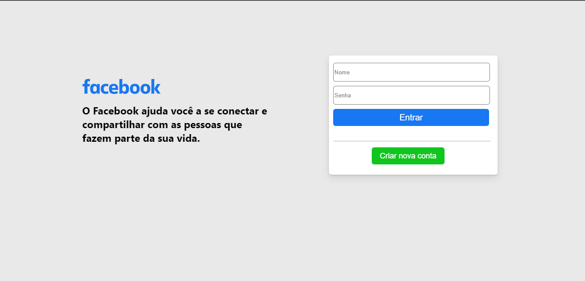
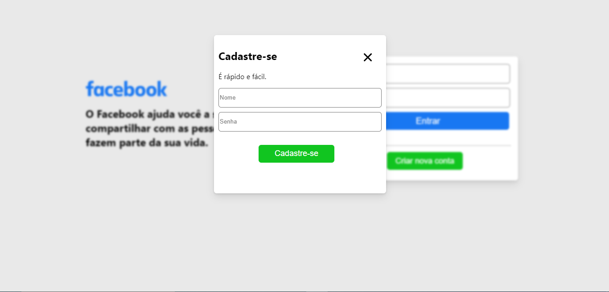
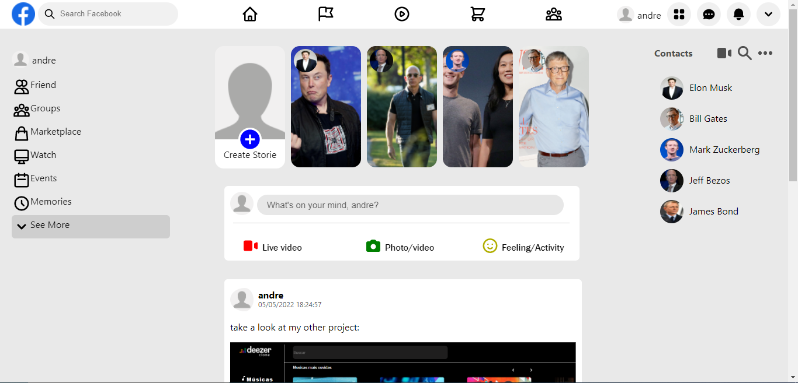

<h1>Facebook Clone</h1>

<li>The goal of the project is to build a Facebook clone to make your posts</li>

<h2> 🖼️ Screenshots </h2>

###  Login page

### homepage

## 🛠️ Technologies used

- 
- 
- 

## 👷 how to run the project

In your terminal run yarn dev and yarn db right after go to http://localhost:3000.